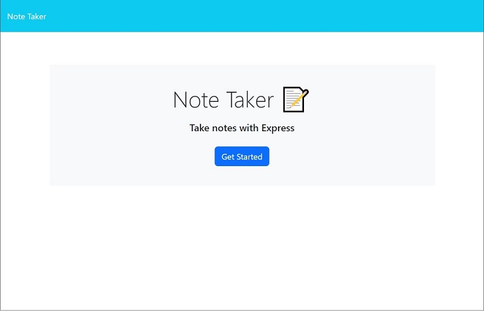
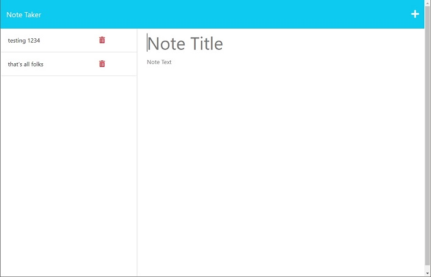

# Note-Taker

  
## Description
    
This is a note taking application that is hosted remotely. Notes are also stored remotely and can be accessed from any device on the internet.
  
## Table of Contents

- [Installation](#installation)
- [Usage](#usage)
- [Contributing](#contributing)
- [Tests](#tests) 
- [Questions](#questions)
- [Credits](#credits)
- [License](#license)
  
## Installation
This application can be accessed at the url below and only requires a browser to operate.
  
  
## Usage
none

## Contributing
none

## Tests
none

## Questions
For any questions, contact me by email or on Github. Relevant links are listed below:

[Contact my GitHub account](https://github.com/Cyanasaurusrex)

email me at: moonman700@gmail.com

## Credits
This application was generated by Nathan Moon.

This application used large potions of code from class exercises, in particular the functions in the 'helpers' folder. 

## license

this application is licensed under MIT license. For more information about this license, please visit:

[Choosealicense.com](https://choosealicense.com/appendix/)